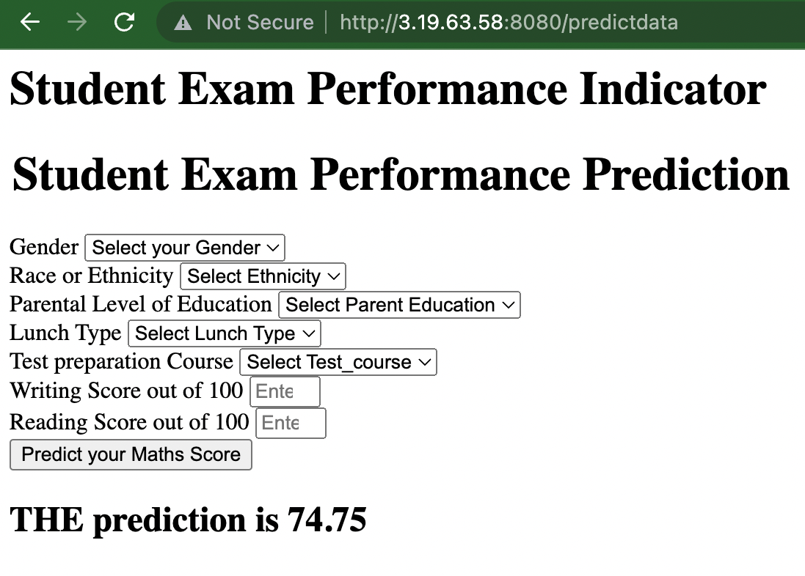

## step by step checks
### To check data ingestion

`python src/components/data_ingestion.py`

## HTML
`predict_datapoint ` in the following line calls the same function in `app.py`:

`<form action="{{ url_for('predict_datapoint')}}" method="post">`

## AWS EC2 deployment
This insturction assumes that you have already
-  created User in aws IAM 
-  setup security credentials

### ECR
- create a repository
- private > name it > click on create repository
- create repository
- copy the URI and save it somewhere. 

### EC2
- Launch Instance
- add name e.g. StudentPerformance
- **Application and OS Images (Amazon Machine Image) :** Ubuntu; free tier
- key pair (create or use an existing one)
- Network setting: allow all 3 (SSH, HTTP, HTTPS)
    - edit and add Custom TCP; 8080, Anywhere
- launch instance and let it load. Once ready
- click on Instance ID
- click on Connect to Instance > EC2 Instance Connect

- Install the packages 
	- `sudo apt-get update -y`
	- `sudo DEBIAN_FRONTEND=noninteractive apt-get upgrade -y`
	- `curl -fsSL https://get.docker.com -o get-docker.sh`
	- `sudo sh get-docker.sh`
	- `sudo usermod -aG docker ubuntu`
	- `newgrp docker`

        
### Githut setup
#### Runner
- settings > actions > runners
- **New self-hosted runner**
- Choose linux
- copy/paste each command under under the **Download** section in the EC2 instance
- copy/paste *first* command under **Configure** section in the EC2 instance
    - Enter for default
    - Enter the name of Runner : self-hosted
    - Enter for default additional label
    - Enter for default Work folder
- copy/paste second command under **Configure** section in the EC2 instance
- **settings > actions > runners**
    - you will see that there is an idle runner called self-hosted

#### Secrets and Variables    
- **settings > secrets and variables > actions**
- New repository secret
    - Name: `AWS_ACCESS_KEY_ID`
    - Copy/paste the Access Key ID from the csv that you downloaded in when you created access keys
- New repository secret
    - Name: `AWS_SECRET_ACCESS_KEY`
    - Copy/paste the Secret access key from the csv that you downloaded in when you created access keys

- New repository secret
    - Name: `AWS_REGION`
    - Copy/paste region of your EC2 instance e.g `us-east-2`
- New repository secret
    - Name: `AWS_ECR_LOGIN_URI`
    - Copy/paste the URI you saved from step ECR ending in .com
- New repository secret
    - Name: `ECR_REPOSITORY_NAME`
    - Copy/past the value after .com in the URI you saved from step ECR        
        
        
        
        
        

- Once you see *Your deployment is complete*, you can check on  that `.github/workflows` has been created in your repo. If you click on it and open the `yml` file, you will see the steps that has been taken to deploy your app. You will see `publish-profile` in the end that has a secret key. To see the value of this secret:
	- click on Settings > Secrets and Variables > Actions
	- You will see the key that was created. 

### See the deployed model
- Go to Github Actions
	You will see the workflow run.

<figure align="center">
	
	<figcaption>Fig.1</figcaption>
</figure> 

- Click on the run to see the steps taken. 

<figure align="center">
	
	<figcaption>Fig.2</figcaption>
</figure>

- On aws EC2 dashboard, choose your instance and click Instance ID.
- Instead of open address, copy/paste the url (`http` instead of `https`) and add `:8080`. It should show you the welcome page.

<figure align="center">
	
	<figcaption>Fig.3</figcaption>
</figure>
    
- add `/predictdata` to the link and it should take you to your app. Fill in the values and hit predict. You will see the prediction.

<figure align="center">
	
	<figcaption>Fig.4</figcaption>
</figure>

- 

### Cleanup to avoid charges
- stop ECR and EC2. 